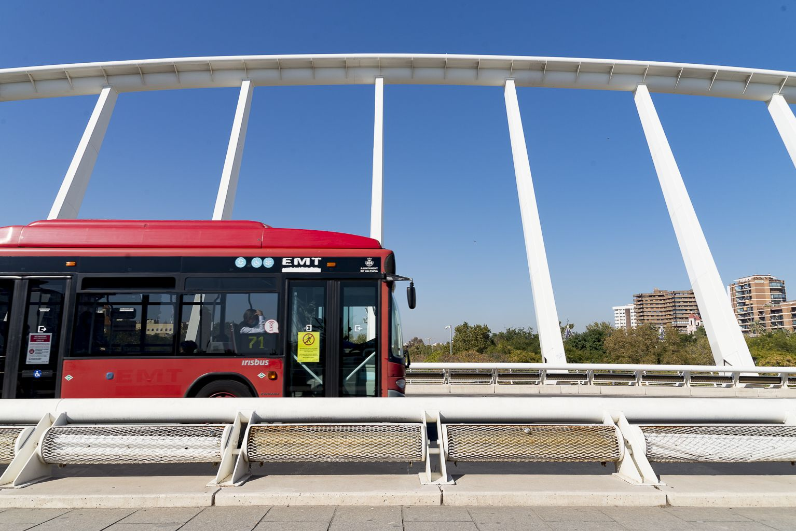

# Valencia in a Minute



Valencia in a Minute es una aplicación web que proporciona información en tiempo real sobre las llegadas y salidas de autobuses, metros y estaciones de Valenbisi en la ciudad de Valencia. Utiliza datos de diversas fuentes para ofrecer a los usuarios tiempos de espera precisos y optimizar sus viajes.

## Características

- **Actualizaciones en tiempo real**: Obtén información instantánea sobre las próximas llegadas de autobuses y trenes.
- **Horarios de EMT**: Consulta los horarios de llegada de los autobuses en las paradas seleccionadas.
- **Horarios de MetroValencia**: Consulta las próximas llegadas y salidas de trenes en las estaciones de metro seleccionadas.
- **Valenbisi**: Calcula el tiempo estimado de viaje entre dos estaciones de Valenbisi.
- **Mapas Interactivos**: Visualiza la distribución geográfica de las paradas de autobús, estaciones de metro y estaciones de Valenbisi.

## Instalación

1. Clona este repositorio:

   ```bash
   git clone https://github.com/tu-usuario/valencia-in-a-minute.git
   cd valencia-in-a-minute

2. Instala dependencias:

   ```bash
   pip install -r requirements.txt

3. Ejecuta la APP:

   ```bash
   streamlit run app.py

## Uso

Para acceder a la APP tan solo haz clik en este link --> [Valencialminutoo](https://valencialminutoo.streamlit.app)

### Página de Inicio

La página de inicio proporciona una descripción general de la aplicación y su propósito.

**Horarios de EMT**

	1.	Selecciona la página “EMT Schedules” en la barra lateral.
	2.	Ingresa el nombre o número de la parada de autobús en el cuadro de texto.
	3.	Selecciona la parada de la lista desplegable.
	4.	Obtén información actualizada sobre las próximas llegadas de autobuses en la parada seleccionada.
	5.	Genera un código QR para la parada seleccionada que redirige a la página con información específica.

**Horarios de MetroValencia**

	1.	Selecciona la página “MetroValencia Schedule” en la barra lateral.
	2.	Ingresa el nombre de la estación de metro en el cuadro de texto (con el nombre parcial funciona, prueba con 'benimac').
	3.	Selecciona la estación de la lista desplegable.
	4.	Consulta las próximas llegadas y salidas de trenes en la estación seleccionada.
	5.	Observa que el tiempo es actualizable cada segundo, si el metro tiene algún problema, tambien se refelja.

**ValenBisi**

	1.	Selecciona la página “ValenBici” en la barra lateral.
	2.	Busca y selecciona dos estaciones de Valenbisi.
	3.	Calcula la duración estimada del viaje entre las dos estaciones.
	4.	Visualiza el recorrido en un mapa interactivo.

## Contribución

### Las contribuciones son bienvenidas. Para contribuir:

	1.	Haz un fork del repositorio.
	2.	Crea una nueva rama (git checkout -b feature/nueva-funcionalidad).
	3.	Realiza tus cambios y haz commit (git commit -am 'Añadir nueva funcionalidad').
	4.	Envía tus cambios a la rama principal (git push origin feature/nueva-funcionalidad).
	5.	Crea un Pull Request.

## Contacto

Para cualquier sugerencia o consulta, envía un correo electrónico a: mrocval@etsinf.upv.es.
